# Social Media App — Authentication + Email 2FA + React 19 Features (WIP 🛠️)

A full-stack social media app built with **Next.js 14** and modern React 19 features.  
Focus on **authentication**, **2FA**, **smooth UI/UX with animations**, and **modern server/client rendering patterns**.

---

## ✅ Implemented

- 🔐 Full authentication flow with **Auth.js**
- 📧 **2FA via email** using **Resend**
- 🛢️ MongoDB + Prisma ORM
- 💅 Responsive UI with **Tailwind CSS**
- ⚛️ **React 19**:
    - `use()` for async rendering
    - `<Suspense>` for data & UI loading
    - `useOptimistic()` for optimistic updates
- 🧩 Animations with **Framer Motion**
- 📦 Modular and scalable folder structure

---

## 🧪 Tech Stack

- **Next.js 14 (App Router, Server Components)**
- **React 19 (use, useOptimistic, Suspense)**
- **TypeScript**
- **Auth.js (NextAuth)** — secure session-based auth
- **Resend.js** — transactional email for 2FA
- **UploadThing** — for file uploads
- **MongoDB + Prisma**
- **Tailwind CSS + Framer Motion**

---

## 🖼️ UI/UX

- Clean design with interactive motion-based transitions
- Page and component-level animations using Framer Motion
- Smooth loading states with Suspense
- Optimistic UI updates for instant feedback

---

## File Uploads

This app uses [UploadThing](https://uploadthing.com/) to handle file uploads securely and efficiently. UploadThing manages the upload flow and callbacks to the API.

---

## 📌 Features in Progress

- User profiles (avatar, bio, etc.)
- Public & private posts
- Follows/followers logic
- Commenting & reactions
- Notifications system
- Real-time chat (WebSocket)
- Image uploads
- Mobile layout and responsive improvements

---

## Screenshots

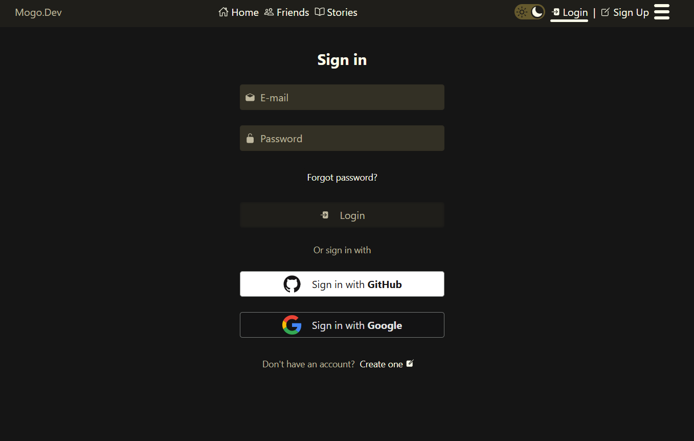

### Sign in page


### Register page

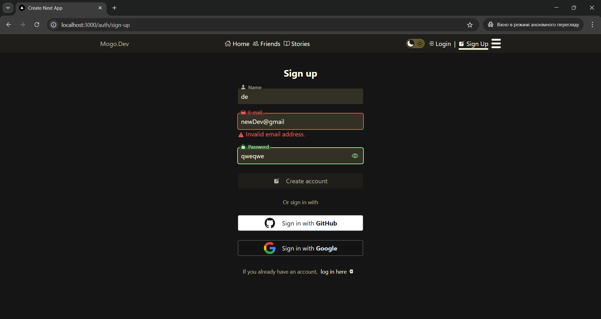

### Register with verification

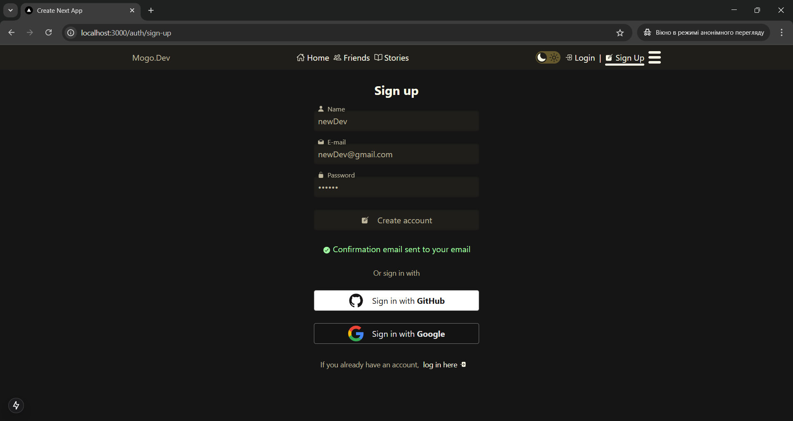

### Friends page

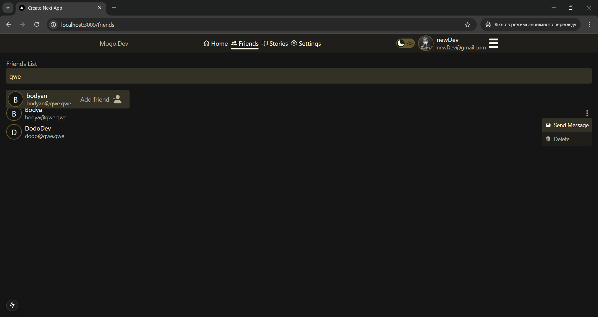

### Friends page. With optimistic updates

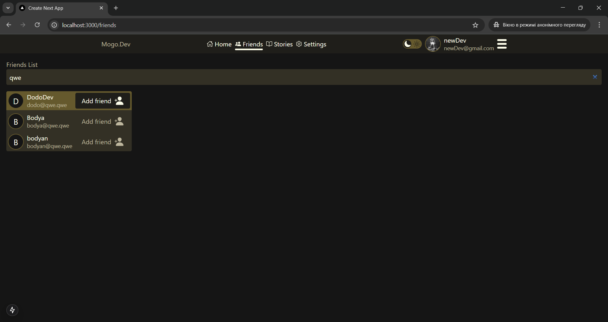
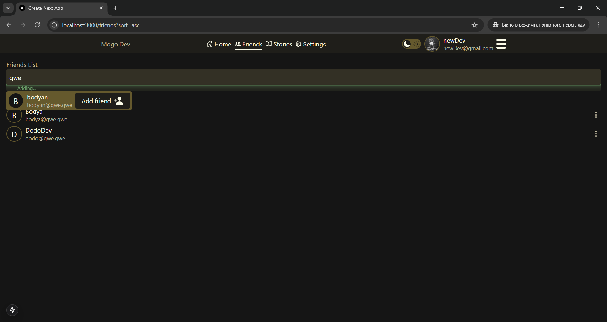

### New verification page

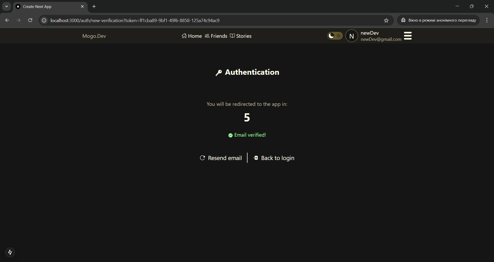

### Settings page

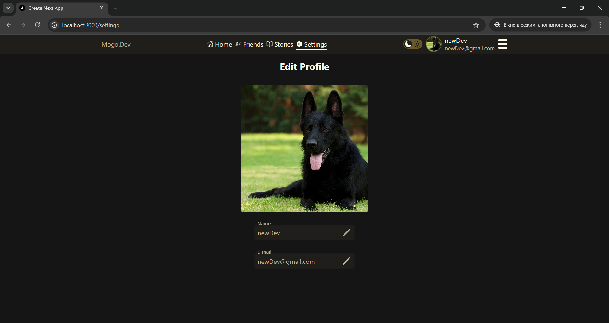

### Settings. Update user image

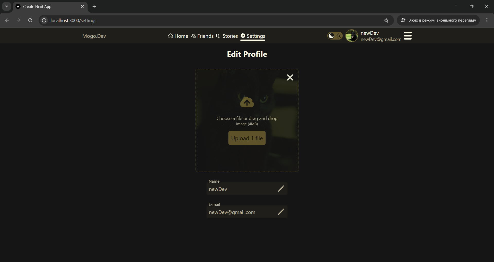
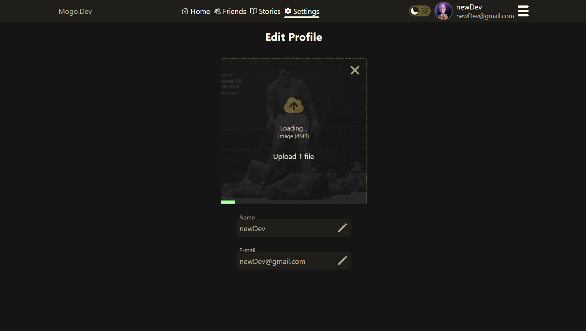

### Theme Menu & Toggle component using Framer Motion

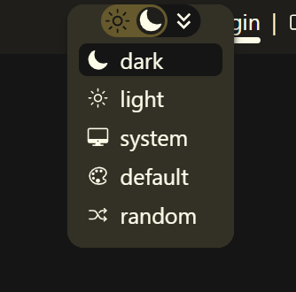

---

## 🧪 Getting Started

```bash
git clone https://github.com/your-username/social-media-app.git
cd social-media-app
npm install
```
